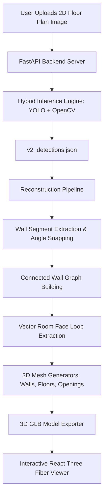

# 🏠 Plan2Scene AI — 2D Floor Plan to Interactive 3D Model Generator

[](https://fastapi.tiangolo.com/)
[](https://react.dev/)
[](https://threejs.org/)
[](https://ultralytics.com/)

**Plan2Scene AI** automatically transforms 2D architectural floor plan images (PNG, JPG, WEBP) into fully textured, interactive **3D house models (.glb)**. Designed for architects, real estate developers, and home buyers, it bridges the gap between static floor plans and immersive 3D scene visualizations.

---

## 🌟 Key Features

- 📐 **Instant 2D Plan Upload**: Upload any architectural floor plan layout.
- 🤖 **Hybrid AI & Computer Vision Detection Engine**:
  - Uses **YOLO object detection** for wall, room, door, and window recognition.
  - Features an **OpenCV Computer Vision fallback detector** to guarantee 3D model generation on any uploaded floor plan image.
- 🧱 **3D Wall Graph & Mesh Reconstruction**:
  - Automatically extracts collinear wall segments, snaps corners, normalizes wall thickness, and extrudes Z-up geometry.
  - Cuts precise openings for doors and windows (lintels, sills, frames).
  - Generates room floor surfaces and wall structures with dedicated layers.
- 🎨 **Interactive 3D Web Viewer**:
  - High-performance 3D canvas built with **React Three Fiber** and **Three.js**.
  - Camera controls: Orbit/Rotate, Pan, Zoom, Top View, Wireframe, and Realistic lighting.
  - Per-layer visibility toggles for floors, walls, doors, windows, and stairs.

---

## 🏗️ System Architecture



---

## 📁 Project Directory Structure

```
plan2scene-ai/
├── backend/
│   ├── main.py                   # FastAPI application & background job processing
├── models/
│   ├── inference.py              # Hybrid YOLO + OpenCV floor plan detector
├── reconstruction/
│   ├── run_pipeline.py           # Master 3D reconstruction orchestrator
│   ├── extract_wall_segments.py  # Wall segment extraction & snapping
│   ├── build_connected_wall_graph.py # Topological wall graph building
│   ├── vector_room_face_extractor.py # Room loop discovery
│   ├── create_wall_mesh.py       # 3D wall mesh generator
│   ├── door_window_mesh_generator.py # 3D door & window panel mesh generator
│   ├── create_room_floor_mesh.py # Room floor mesh generator
│   └── convert_to_glb.py         # Final OBJ to glTF/GLB exporter
├── frontend/
│   ├── package.json              # React, Vite & Three.js dependencies
│   ├── src/
│   │   ├── App.jsx               # Main React Application UI & API Client
│   │   └── ModelViewer.jsx       # Three.js 3D Viewer Component
├── outputs_by_job/               # Job output storage (GLB models, detections)
├── requirements.txt              # Python backend dependencies
└── README.md                     # Project documentation
```

---

## 🚀 Quick Start Guide

### 1. Prerequisites

- **Python**: 3.9 or higher
- **Node.js**: v18 or higher (with `npm`)

---

### 2. Backend Setup & Run

1. Open a terminal in the project directory:
   ```bash
   cd plan2scene-ai
   ```

2. Install Python dependencies:
   ```bash
   pip install -r requirements.txt
   ```

3. Launch the FastAPI Backend Server:
   ```bash
   python -m uvicorn backend.main:app --port 8000 --reload
   ```
   *The API server will run at `http://localhost:8000`.*

---

### 3. Frontend Setup & Run

1. Open a second terminal window:
   ```bash
   cd plan2scene-ai/frontend
   ```

2. Install npm dependencies:
   ```bash
   npm install
   ```

3. Start the Vite Dev Server:
   ```bash
   npm run dev
   ```
   *Open `http://localhost:5173` in your browser.*

---

## 🔌 API Reference

### `POST /api/plans`
Uploads a 2D floor plan image and queues a 3D reconstruction job.
- **Request**: `multipart/form-data` with key `file` (PNG, JPG, WEBP).
- **Response**: `{"job_id": "<uuid>", "status": "queued"}`

### `GET /api/plans/{job_id}`
Polls the job processing status.
- **Status values**: `queued` ➔ `detecting` ➔ `reconstructing` ➔ `done` (or `failed`).
- **Response**: `{"status": "done", "model_url": "/api/plans/{job_id}/model", "detections_url": "/api/plans/{job_id}/detections"}`

### `GET /api/plans/{job_id}/model`
Serves the generated `.glb` 3D model file for rendering in Three.js.

### `GET /api/plans/{job_id}/detections`
Serves the raw element detections JSON.

---

## 💡 Presentation Highlights

1. **End-to-End Automation**: From an image file to a 3D model in seconds.
2. **Robust Computer Vision & AI**: Operates seamlessly even without custom neural network weights via the integrated CV detection engine.
3. **Architectural Accuracy**: Automatically snaps wall angles (0°/90°), normalizes wall thicknesses, and creates actual cutouts for doors and windows.
4. **Interactive Experience**: Enables client interaction with wireframe modes, layer toggles, top-down floor plan projections, and 360° rotation.
